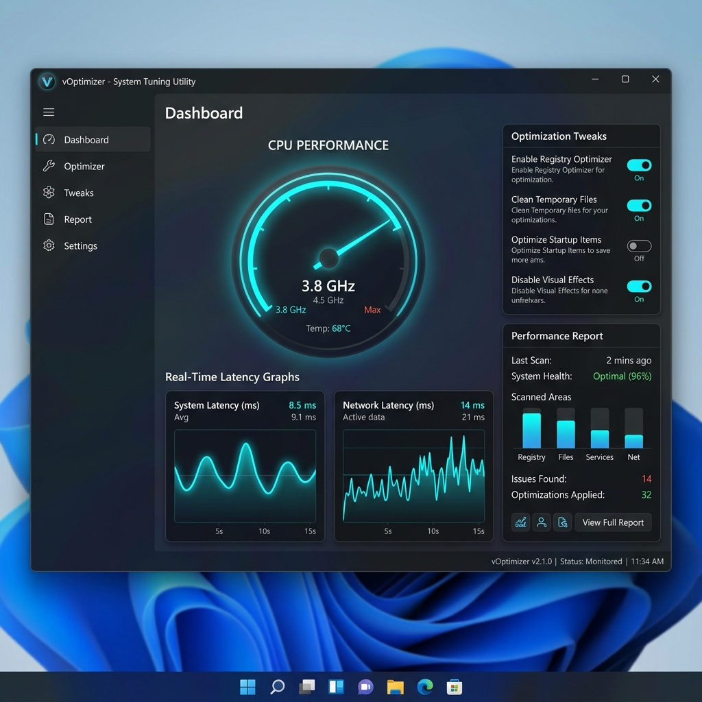

<p align="center">
  
</p>

<h1 align="center">vOptimizer</h1>

<p align="center">
  A lightweight, low-level Windows performance utility for gamers and power users.
</p>

<p align="center">
  <a href="https://github.com/tDn412/vOptimizer/releases">
    
  </a>
  <a href="https://github.com/tDn412/vOptimizer/releases">
    
  </a>
  <a href="https://dotnet.microsoft.com/download">
    
  </a>
  <a href="https://www.microsoft.com/windows">
    
  </a>
  <a href="https://github.com/tDn412/vOptimizer/blob/main/LICENSE">
    
  </a>
</p>

---

## Overview

**vOptimizer** is a standalone, elevated system tuner designed to minimize input latency, lock CPU timer resolution, optimize power configurations, and fine-tune hardware parameters. Built with .NET 8 and styled using Fluent Design (via WPF-UI), it acts as a central hub for low-level system calibration.

<p align="center">
  
</p>

## Key Optimization Modules

### ⚡ Timer Resolution & CPU Core Parking
- **Timer Resolution:** Locks system clock intervals to a precise `0.5 ms` (standard Windows default is `15.6 ms`) using native multimedia APIs to reduce scheduling latency.
- **Core Parking:** Disables CPU core parking under custom power profiles, ensuring all physical cores remain awake and ready for immediate thread execution.

### 🎛️ Windows Registry Latency Tweaks
- **Foreground Responsiveness:** Configures `Win32PrioritySeparation` to `38` (Short, Variable, High foreground boost) to prioritize game and active application threads.
- **Keyboard Optimization:** Reduces input repeat delay (`KeyboardDelay` = `0`) and increases repeat rate (`KeyboardSpeed` = `31`) directly in the registry.
- **Accessibility Hotkeys:** Disables Windows sticky, toggle, and filter keys to prevent unexpected overlays during active gaming.

### 🔋 Power Plan & Hardware Management
- **High Performance Profiles:** Automates swapping between balanced and high-performance energy states.
- **AMD & Intel Overclock/Undervolt Framework:** Extends controls for platform-specific hardware adjustments (utilizing `WinRing0` for Intel MSR writes and custom Curve Optimizer parameters for AMD platforms).

---

## Getting Started

### Prerequisites
- **Operating System:** Windows 10 or Windows 11 (64-bit).
- **Runtime:** [.NET Desktop Runtime 8.0](https://dotnet.microsoft.com/download/dotnet/8.0).
- **Permissions:** **Administrator Privileges** are required to modify registry keys, adjust system timer resolutions, and call hardware APIs.

### Installation
1. Navigate to the **[Releases](https://github.com/tDn412/vOptimizer/releases)** section.
2. Download the latest version of `vOptimizer.exe`.
3. Right-click the executable and select **Run as Administrator**.

---

## Building from Source

To compile the application locally, you will need the [.NET 8.0 SDK](https://dotnet.microsoft.com/download) and Visual Studio 2022 (or JetBrains Rider).

```bash
# Clone the repository
git clone https://github.com/tDn412/vOptimizer.git
cd vOptimizer

# Restore dependencies & compile
dotnet build -c Release
```

The compiled binary will be located in `vOptimizer/bin/Release/net8.0-windows/`.

---

## Safety & Disclaimer

> [!WARNING]
> This software modifies critical system settings, registry configurations, and hardware parameters. While these configurations are tailored to improve latency, always create a **System Restore Point** before applying optimization registry tweaks. Use at your own risk.

## License
This project is licensed under the MIT License. See the [LICENSE](LICENSE) file for details.
